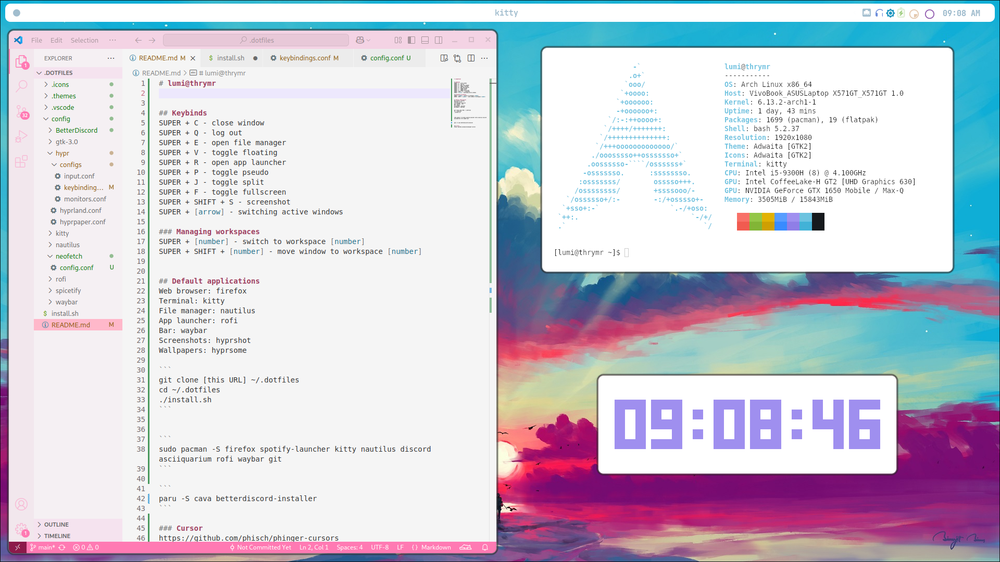

# andromeda 🌌✨


## Keybinds
SUPER + C - close window
SUPER + Q - log out
SUPER + E - open file manager
SUPER + V - toggle floating
SUPER + R - open app launcher
SUPER + P - toggle pseudo
SUPER + J - toggle split
SUPER + F - toggle fullscreen
SUPER + SHIFT + S - screenshot
SUPER + [arrow] - switching active windows

### Managing workspaces
SUPER + [number] - switch to workspace [number]
SUPER + SHIFT + [number] - move window to workspace [number]


## Default applications
Web browser: firefox
Terminal: kitty
File manager: nautilus
App launcher: rofi
Bar: waybar
Screenshots: hyprshot
Wallpapers: hyprsome

```
git clone [this URL] ~/.dotfiles
cd ~/.dotfiles
./install.sh
```


```
sudo pacman -S firefox spotify-launcher kitty nautilus discord asciiquarium rofi waybar git
```

```
paru -S cava betterdiscord-installer 
```

### Cursor
https://github.com/phisch/phinger-cursors